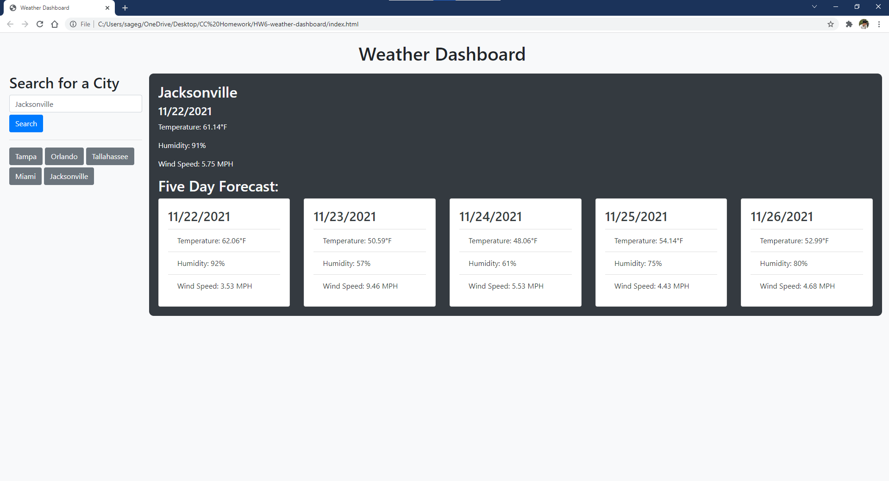

<!--
search for a city
    save to search history
        clickable history
    current and future weather conditions
        city name, date, icon
        temp, humidity, wind speed, uv index (uv index has color depending on value)
    five day forecast
        date, icon, temperature, wind speed, humidity
 -->

# HW6 Weather Dashboard
## Description

This is a js based weather dashboard that pulls from the open weather api.
## Contents
- [Usage](#usage)
- [Contributors](#contributors)
- [License](#license)
- [Contact](#contact)

## Usage
Using the deployed project, enter a city name and click search. This will show the current weather as well as a five day forecast.

## License
The project uses the [Do WTF You Want To](http://www.wtfpl.net/) license.
## Contact
Link to my github: [sagegrayson](https://github.com/sagegrayson)

If you'd like to contact me, email me at [skaseyg@gmail.com](mailto:skaseyg@gmail.com)
